# Architecture & Dataflow

How Forza telemetry moves through the system — from the game's UDP packets to
the database and the browser. For *what* fields mean and the recording rules in
detail, see [`DESIGN.md`](../DESIGN.md); this document is about *how the system
is built* and the paths data takes.

## Design spine: ports & adapters

Everything pivots on one canonical model, **`Telemetry`**
(`server/utils/decode.ts`). Each game speaks its own UDP byte layout; a per-game
**adapter** (`server/adapters/<id>.ts`) maps those bytes onto `Telemetry`, and
*nothing downstream ever sees raw bytes again* — the bus, recorder, rolling
measurements, WebSocket, storage codec, and the entire frontend depend only on
`Telemetry`.

- **Port** = the `Telemetry` model.
- **Adapters** = the per-game decoders, registered in `server/adapters/index.ts`
  and selected by `getActiveAdapter()` (env `FORZA_GAME`, defaults to FH6).
- Adding a game = implement one `TelemetryAdapter` and register it. Nothing else
  changes.

```mermaid
flowchart TD
    G["🎮 Forza game<br/>UDP 'Car Dash' · ~60 Hz · ~324 B"]

    subgraph SERVER["Server — Nitro"]
        direction TB
        L["forza-listener.ts<br/>UDP socket"]
        DEC["adapter.decode<br/>bytes → Telemetry"]
        BUS(["forzaBus · EventEmitter"])
        WS["WebSocket fan-out<br/>_ws.ts"]
        RM["3× RollingMeasurement<br/>30 s window · ~5 Hz"]
        REC["Recorder<br/>state machine"]
        ENC["encodeFramesAsync<br/>FZC1 columnar + gzip · off-loop"]
        API["Analytics API<br/>decodeFrames + aggregate"]
    end

    subgraph DB["SQLite / LibSQL"]
        LAPS[("laps · framesBlob")]
        META[("events · sessions · cars<br/>builds · tunes")]
    end

    subgraph FE["Frontend — Nuxt 4"]
        UT["useTelemetry<br/>WS client · rAF-coalesced"]
        LIVE["/live dashboard"]
        REPLAY["/replay · /compare · /tune"]
    end

    G -->|UDP| L --> DEC --> BUS
    BUS -->|telemetry| RM -->|measurement| BUS
    BUS -->|telemetry| REC
    BUS --> WS
    REC -->|flush per lap| ENC --> LAPS
    WS -. "WS push: telemetry + measurements" .-> UT --> LIVE
    REPLAY ==>|HTTP pull| API ==>|JSON| REPLAY
    LAPS -->|"raw frames / aggregates"| API
    META --> API
```



There are two decoupling seams: the **`Telemetry` port** isolates game byte
formats, and the **`forzaBus`** isolates ingest from every consumer.

---

## Path A — Live (the hot path), ~60 Hz

### Ingest — `server/plugins/forza-listener.ts`
A Nitro plugin opens one UDP socket per game on boot, each bound to its
adapter's fixed default port on `0.0.0.0` (relocate a clash via Docker `-p`).
Each datagram → that port's `adapter.decode(buf)` → `Telemetry` (or `null`,
ignored). A 500 ms watchdog flips the "connected" status when packets stop.
Each decoded frame is published with a single `forzaBus.emit('telemetry', t)`.

### The bus — `server/utils/forza-bus.ts`
A typed Node `EventEmitter`, the single in-process decoupling point. Producers
(the listener) and consumers never reference each other. Events:
`telemetry`, `recording_state`, `tune_prompt`, `forza_status`, `measurement`.

### Three consumers subscribe to `telemetry`

1. **WebSocket fan-out** — `server/routes/_ws.ts`. On each client `open`, it
   registers per-peer listeners that `JSON.stringify` + send each bus event to
   that peer, and detaches them on `close`. This is the live wire to the
   browser; every frame is forwarded as it arrives.

2. **Rolling measurements** — `server/utils/rolling-window.ts` + three concrete
   ones (`rolling-tb-percent`, `rolling-coast-time`, `rolling-pedal-overlap`).
   Each keeps a sliding 30 s window of *only the channels it needs* and, every
   12th frame (~5 Hz), folds the window into one value and emits a `measurement`
   event. These reuse the **same pure detectors** as the per-lap analytics — fed
   a live window instead of a stored lap — so live and post-hoc numbers agree by
   construction.

3. **Recorder** — `server/utils/recorder.ts`. See Path B.

### Frontend live consumption — `app/composables/useTelemetry.ts`
A singleton WebSocket client (ref-counted across components). It parses inbound
messages and, for `telemetry`, **coalesces to one commit per animation frame**:
every sample still lands in the 30 s trace ring and frames buffer, but the
reactive `telemetry` that re-renders the heavy `CornerView` updates at most once
per paint. This caps rendering at the display rate and prevents an unbounded
backlog if the client falls behind. It also closes the socket while the tab is
hidden. Drives `/live` (`app/pages/live.vue`).

---

## Path B — Recording (buffer → database)

The **Recorder** (`server/utils/recorder.ts`) is a state machine
(`IDLE → RECORDING → IDLE`) driven by `start`/`stop` WebSocket commands. It lives
on the server, so recording survives a browser refresh — the browser is only a
viewer/controller.

- **Buffering:** while recording, each live frame is stored as a **flat
  per-frame record** (`encodeFrame`, the compact codec) rather than a deep
  `Telemetry` object — this keeps the live object count low so GC doesn't stall
  the feed on long runs.
- **Gating:** frames with `isRaceOn === false` are never buffered (loading
  screens, countdowns, pause menu, finish UI). `isRaceOn` means "data is live,"
  not "a race is running."
- **Lap segmentation:** on each `LapNumber` transition the buffer flushes as one
  lap (the first transition after `start()` is discarded as a mid-lap join). For
  point-to-point / free-roam runs where `LapNumber` never ticks, the whole
  Start→Stop window flushes as a single lap at `stop()`.
- **Flush** (`flushLap`): decode records → `Telemetry[]` →
  `encodeFramesAsync` (columnar **FZC1** + gzip, run **off the event loop**) →
  `INSERT` into `laps`. Flushes are **serialized on a chain**, and `stop()`
  awaits it so every lap is persisted before it resolves. `stop()` also diffs PI
  against the car's previous session and emits a `tune_prompt` when it shifted.

### Storage — `server/db/schema.ts` (SQLite/LibSQL via Drizzle + NuxtHub)

```
events ──< sessions >── cars
                │  └─ buildId / tuneId (+ JSON snapshots of each at record time)
                └──< laps (lapNumber, timeMs, framesBlob)

builds ──< tunes     (per-car upgrade config / slider config)
```

A lap's frames are one **gzipped columnar blob** (`server/utils/frames-codec.ts`,
magic `FZC1`): each numeric field is stored as a contiguous `f32` column (`f64`
for timestamps), nullable fields carry a per-frame presence bit, and booleans are
packed into bitsets. It decodes ~22× faster than the original gzipped-JSON,
which old blobs still are — `decodeFrames` sniffs the leading bytes, so both
formats coexist with no migration.

The same module also provides `encodeFrame` / `decodeFrame` — a row-wise,
ungzipped per-frame record used only as the recorder's in-memory buffer entry
(decoded back to frames at flush).

---

## Path C — Analytics / read (database → frontend)

Pages fetch over HTTP (`$fetch` / `useFetch`) against `server/api/**`. Two
deliberate strategies:

1. **Aggregate on the server, ship tiny JSON** —
   `server/api/sessions/[id]/{dyno,compare,trail-braking,sectors}.get.ts`. These
   read the lap blobs, `decodeFrames`, run the *same pure aggregation utilities*
   the live path uses, and return a small (<1 KB) result. A 5-lap session is
   ~36 MB of frames but its dyno curve is under a kilobyte — so summaries never
   stream raw frames.

2. **Ship raw frames** — `server/api/laps/[id]/frames.get.ts` decodes one lap's
   blob and returns the full `Telemetry[]` plus car/build/tune context. This
   feeds the **replay** view, which mounts `ReplayPlayer.vue` and plays the lap
   back frame-by-frame on its own rAF clock (`useReplay`). The dyno-as-it-plays
   there streams incrementally (ingest only newly-revealed frames) rather than
   re-binning the whole slice each tick.

Plain CRUD endpoints (`events`, `cars`, `builds`, `tunes`, `sessions`) back the
management UI.

---

## Defining properties

- **Pure, shared analytics.** The detectors and binners (`app/utils/*`,
  `dyno.ts`) are framework-free and run *both* live (over a sliding window) and
  on stored laps (over a blob). Live strips and post-hoc reports therefore agree
  by construction.
- **Server owns recording.** It survives browser refresh; the browser starts,
  stops, and views.
- **Live is push, saved is pull.** Live telemetry is a WebSocket push; saved
  data is HTTP pull — two transports for two needs.
- **Backpressure / cost control is explicit.** Rendering is rAF-paced
  (`useTelemetry`), the recorder buffers compact records and gzips off-loop, and
  summary endpoints aggregate server-side instead of shipping frames. See the
  `perf(*)` commits for the rationale behind each.

---

## File map (where to look)

| Concern | File |
| --- | --- |
| Canonical model (the port) | `server/utils/decode.ts` |
| Game decoders (adapters) | `server/adapters/{index,fh6,fh5,horizon-cardash}.ts` |
| UDP ingest | `server/plugins/forza-listener.ts` |
| In-process event hub | `server/utils/forza-bus.ts` |
| Live WebSocket | `server/routes/_ws.ts` |
| Rolling live measurements | `server/utils/rolling-window.ts`, `rolling-*.ts` |
| Recording state machine | `server/utils/recorder.ts` |
| Lap storage codec (FZC1) | `server/utils/frames-codec.ts` |
| DB schema | `server/db/schema.ts` |
| Analytics endpoints | `server/api/sessions/[id]/*.get.ts`, `laps/[id]/frames.get.ts` |
| Live client / WS consumer | `app/composables/useTelemetry.ts`, `app/pages/live.vue` |
| Replay client | `app/composables/useReplay.ts`, `app/components/ReplayPlayer.vue` |
| Shared pure analytics | `app/utils/*.ts` (e.g. `dyno.ts`, `trail-braking.ts`) |
